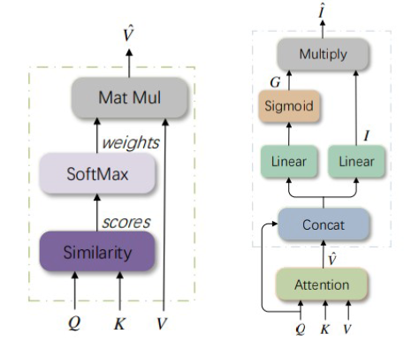
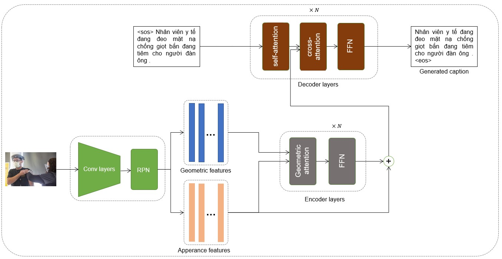
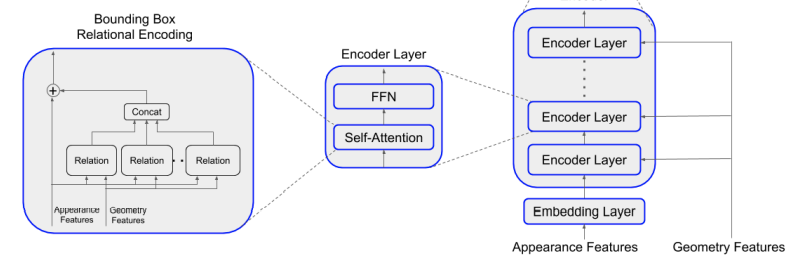
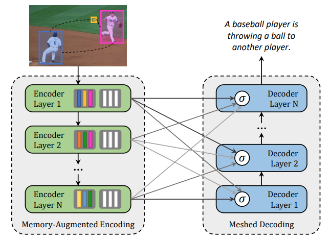

OpenViIC - Open Vietnamese Image Captioning
====

This is an open-source repository for researching Vietnamese Image Captioning tasks. This repo implements most recent transformer-based state-of-the-art methods on the MS COCO Image Captioning datataset to evaluate them on the first two Vietnamese Image Captioning dataset [UIT-ViIC](https://arxiv.org/pdf/2002.00175.pdf) and [vieCap4H](https://people.cs.umu.se/sonvx/files/VieCap4H_VLSP21.pdf).

## Current approaches used in this project

### Region-based visual feature using [Faster-RCNN](https://arxiv.org/pdf/1506.01497.pdf)

[Bottom-up and Top-down attention](https://arxiv.org/abs/1707.07998) is an effective way to ignore unnecessary regions of the images, focus the deep learning methods to important regions for better image understanding.

### Grid-based visual feature

### [Attention on Attention Network](https://arxiv.org/pdf/1908.06954.pdf)

Firstly proposed by [Huang et al.](https://arxiv.org/pdf/1908.06954.pdf) to enhance the correlation between query vector and output vector of the [original transformer](https://arxiv.org/pdf/1706.03762) layer.

### [Object Relation Transformer](https://arxiv.org/pdf/1906.05963.pdf)

Built on top of Bottom-up Attention mechanisms, Object Relation Transformer (ORT) provides its encoder layers geometric information of objects in image for better understading the image.

### [Meshed-Memory Transformer](https://arxiv.org/pdf/1912.08226.pdf)

Built on top of Buttom-up Attention, Meshed-Memory Transformer uses augmented memory to catch internal relation between objects in images. Moreover, Meshed-Memory Transformer is also equipped meshed decoder layers for better language understanding and generating.

### [RSTNet](https://openaccess.thecvf.com/content/CVPR2021/papers/Zhang_RSTNet_Captioning_With_Adaptive_Attention_on_Visual_and_Non-Visual_Words_CVPR_2021_paper.pdf)

## Contact
This project constructed under the NLP@UIT research group. For more information about the NLP@UIT group or relevant publications, please visit [http://nlp.uit.edu.vn/](http://nlp.uit.edu.vn/).

 - Nghia Hieu Nguyen: [19520178@gm.uit.edu.vn](mailto:19520178@gm.uit.edu.vn)
 - Duong T.D Vo: [19520483@gm.uit.edu.vn](mailto:19520483@gm.uit.edu.vn)
 - Minh Quan Ha: [19522076@gm.uit.edu.vn](mailto:19522076@gm.uit.edu.vn)